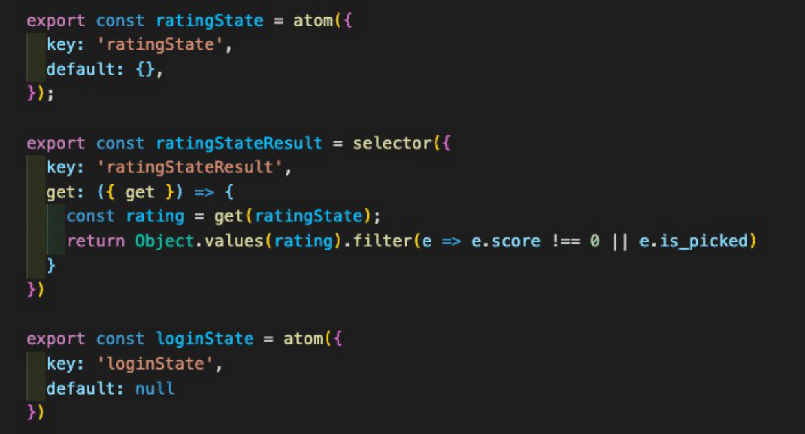
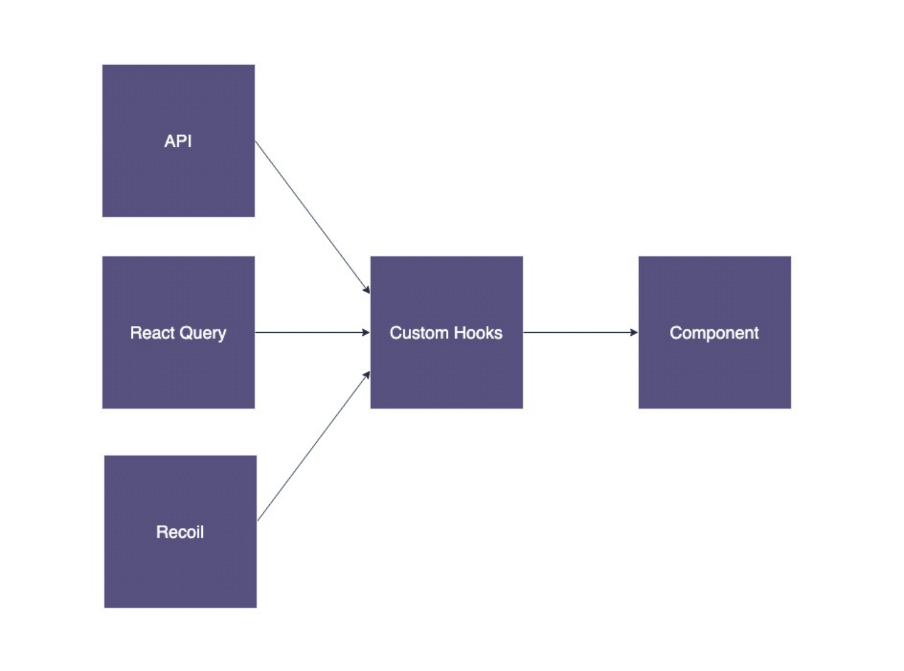

# readme

# Frontend README file

## 프론트 포지션 팀원

|  이름  |       이메일        |
| :----: | :-----------------: |
| 김현하 | gusgk2658@naver.com |

## 목차

- [상태관리](#1-상태관리)

  - [상태관리](#상태관리)

  - [Recoil](#Recoil)

  - [React-Query](#React-Query)

- [Custom-Hooks](#2-Custom-Hooks)
- [UI 개선 스터디](#3-스터디)

---

## 1. 상태관리

### 상태관리

프론트엔드 개발시에 서버로 부터 받아오는 데이터도 사용하지만, 사용자의 로그인 정보나 UI와 관련된 데이터, 서비스의 데이터 등 애플리케이션의 상태를 저장하고 관리할 전역 스토어가 필요할 것이다.

이러한 상태관리를 위해서 이번 프로젝트에서는 Recoil과 React Query를 사용하였다.

### Recoil

Recoil은 이전에 사용해 봤던 redux에 비해 단순한 인터페이스를 사용하면서 state를 전역상태로 관리할 수 있었다.

이번 프로젝트에서는 컴포넌트 뎁스가 깊지 않아 props drilling이 심하지 않다 생각되어 대부분 state/props로 관리하였다. 하지만 페이지 전환 시 전달해주어야 할 데이터가 있는 경우와 로그인 상태 같은 경우에는 전역상태로 다루어야 할 필요가 있었었다. 전역으로 사용 할 state가 많지 않았기 때문에 recoil을 이용하여 간단하게 관리할 수 있었다.

- useRecoilState

  - 컴포넌트에서의 사용방법은 react hook과 비슷하여 이해하는데 오래 걸리지 않았다.

  - `const [login, setLogin] = useRecoilState(loginState);`

- useRecoilState 친구들

  - 전역으로 관리하기 state들이기 때문에, 값만 필요한 컴포넌트도 있을 것이고, 값을 변경하기만 하는 컴포넌트도 있을 것이다.

  - 이 때는 useRecoilValue과 useSetRecoilState를 잘 활용하여 사용하였다.

  - `const login = useRecoilValue(loginState);`

  - `const setLogin = useSetRecoilState(loginState);`

- selector

  - selector는 하나의 상태이지만 파생된 것이다. selector는 atom로부터 값을 얻을 수 있고 atom에 영향을 줄 수도 있다.
    

### React Query

React query는 서버 데이터를 다루기 위한 상태관리 라이브러리이다. 서버 데이터를 관리하는 것에 가장 큰 목적이 있는 라이브러리지만 이번 프로젝트에서는 서버 데이터의 변경이 많지 않기 때문에 데이터 캐싱에 대한 부분은 많이 활용하지 못한것 같다. 하지만 useQuery 훅에서 제공하는 data, isLoading, isFetching, refetch등의 다양한 변수와 함수를 활용하여 컴포넌트 내에서 여러 개의 state를 사용하여 처리해야 할 복잡한 비동기 관련 로직들을 간단하게 사용할 수 있었다.

- **useQuery**

  - `const {isLoading, isError, isSuccess, isIdle, status, error, data, isFetching }=useQuery([uniqueKey,arg1,..],()=>method(arg1),config);`

  - useQuery훅의 인자로 2개가 들어간다
    - 쿼리의 unique한 key, 프로미스를 리턴하는 함수 (이 함수는 반드시 resolve Promise를 리턴하거나 에러를 throw해야 한다.
  - unique key : 배열의 요소로 쿼리의 이름을 나타내는 문자열과 프로미스를 리턴하는 함수의 인자로 쓰이는 값을 넣는다.
  - useQuery 반환값 : 객체, 요청의 상태를 나타내는 몇가지 프로퍼티, 요청의 결과나 에러값을 갖는 프로퍼티도 포함한다

    - **isLoading**, isError, isSuccess, isIdle, **status**
    - error, data, isFetching ⇒ 런타임간 무조건 요청이 한 번 이상 발생했다면 값이 존재한다.

  - 주요 쿼리 옵션
    - enabled : True로 설정하면 자동으로 쿼리의 요청 함수가 호출되는 일이 없다
    - keepPreviousData : success와 loading 사이 널뛰기 방지
    - placeholderData : mock 데이터 설정도 가능. 얘는 근데 캐싱이 안됨
    - initialData : 초기값 설정
    - 쿼리에 여러가지 옵션 설정을 통해 입맛대로 데이터를 관리할 수 있다.

- **useInfiniteQuery**

  - Infinite scroll을 구현할 때 사용하였다. 페이지에 대한 상태를 기억해 준다.

  - `const {fetchNextPage, fetchPreviousPage, hasNextPage, hasPreviousPage, isFetchingNextPage, isFetchingPreviousPage, ...result} = useInfiniteQuery(queryKey, ({ pageParam = 1 }) => fetchPage(pageParam), {...options,getNextPageParam: (lastPage, allPages) => lastPage.nextCursor,getPreviousPageParam: (firstPage, allPages) => firstPage.prevCursor,})`

- useMutation

## 2. Custom Hooks

### custom hook을 활용하여 뷰를 위한 코드와 데이터를 위한 코드의 관심사를 분리 할 수 있었다.

> 관심사의 분리가 무엇인지?

- 한 컴포넌트에 많은 처리를 하게 되면 코드가 복잡해진다. 하나의 관심사만 가지게 작성한다면 낮은 결합도와 높은 응집도를 가지게 할 수 있다.
- 이로 인해 코드가 간단해지면서 유지 보수가 쉬워지고 코드의 재사용성을 높일 수 있다.
- 또한 테스트 코드작성도 쉬워진다.

### 로그인된 상태인지 확인하는 useAuth

- session cookie방식으로 로그인을 구현 하였는데 어플리케이션에 진입할 때마다 로그인 상태인지 확인하는 api를 사용하여 session이 유효한지 확인하였다.

### 상태관리에 관련된 코드를 custom hooks에서 처리해주었다.

- 콘텐츠의 데이터 api통신과 관련된 코드가 있는 useContent
- 사용자가 평가한 콘텐츠를 가져오는 api 통신 useUserPick
- 사용자가 선택한 콘텐츠를 보내고 결과를 받아오는 api통신 useResult
- 콘텐츠 리스트를 infinite scroll로 가져올 수 있게 하는 api 통신 useContentListQuery

### 회원가입, 로그인시 사용하는 input에 값의 변경을 감지하고 저장해주는 useInput

## UI 개선 스터디

### 스터디를 진행한 이유

프로젝트를 진행할 때에는 일단 기능이 돌아가게 만드는 것에 집중하다 보니 사용자 경험에 대한 고민을 많이 하지 못한 것 같았다. 그래서 스터디 기간동안 실제로 사용하면서 느낄만한 불편한 점을 찾아보고 개선하고 코드에 대한 개선도 진행하였다.

1. 📱 반응형으로 개선

- 헤더의 네비게이션 바를 모바일 화면에서 사용할 시에는 토글 버튼을 사용하여 볼 수 있도록 개선

2. 🖼  이미지 로딩 스켈레톤 추가

- 이미지 로드시 이미지를 로드 중이라는 것을 사용자에게 알려주기 위해 로딩 스켈레톤 추가
- my page와 survey result 페이지에는 css 애니메이션을 사용하여 로딩 표시
- survey 페이지의 콘텐츠 포스터에는 콘텐츠 제목을 보여 줌으로써 로딩 표시

3.  🪄 프로젝트 소개 페이지 개선

- aos라이브러리 사용하여 에니메이션 효과 추가

4. 📜 디테일 페이지 모달창으로 변경

- 메인페이지에서 인기 콘텐츠나 검색한 콘텐츠의 자세한 내용을 보여 주는 부분을 배너와 같은 위치에 보여주고 있었지만 배경으로 사용할 스틸이미지 등이 없어 모달창으로 UI를 변경

5.  ❗️ 버튼, 스크롤 등 사용시 불편한점 개선

- survey 페이지에서 2개로 위치해고 있는 버튼을 1개로 통합
- survey 페이지에서 스크롤을 내리며 콘텐츠를 선택한 후 다음 단계로 가는 버튼을 누르려면 스크롤을 다시 올려야하는 문제가 있어 버튼과 진행바를 고정시켜 UX개선

6.  🎨 추천 결과 UI

- 추천 콘텐츠를 보여주는 부분에서 아이템의 길이가 모두 달라서 중간에 빈부분이 있었는데 이 부분을 개선하기 위해 핀터레스트 스타일 레이아웃을 구현

7.  📬 소셜 로그인기능 추가

- kakao로그인 기능 추가
